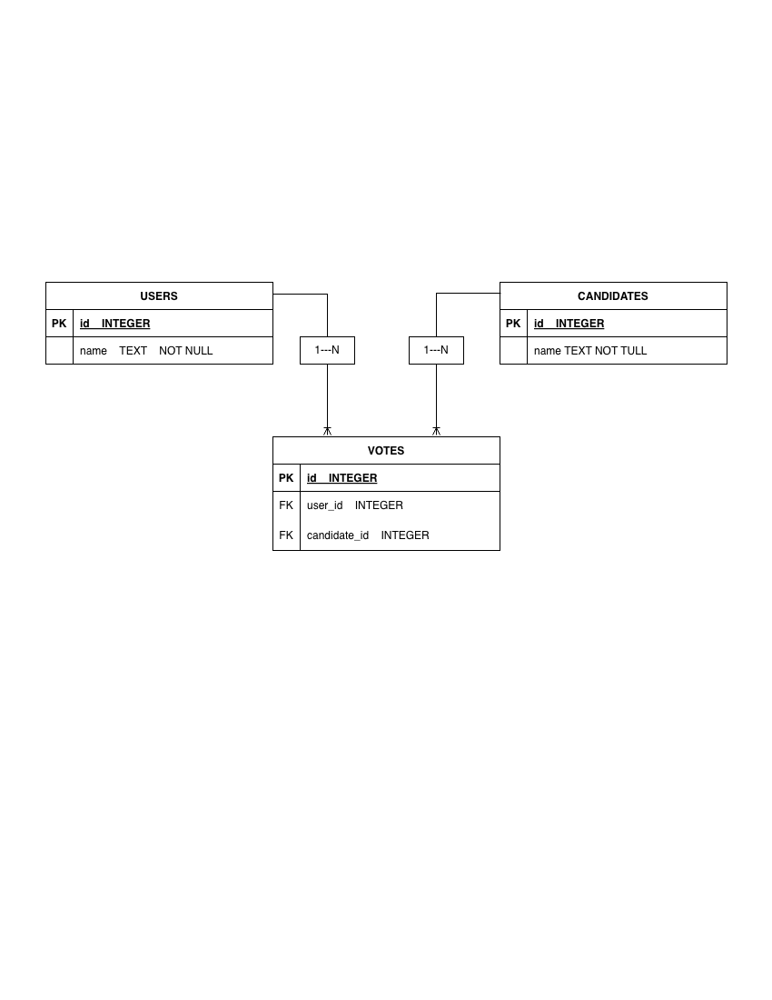

# 🗳️ SISTEM VOTING ONLINE - KELOMPOK 2

## 📖 Deskripsi Singkat
Proyek ini adalah aplikasi **Sistem Voting Online (Fullstack)** yang dibangun untuk memenuhi Tugas Proyek Akhir Mata Kuliah Backend Development. Aplikasi ini menggunakan **FastAPI** (Python) untuk Backend dan **HTML/JS Native** untuk Frontend.

Sistem ini menjamin keamanan dan keadilan voting dengan prinsip **"Satu Pengguna Satu Suara"** (*One Man One Vote*) menggunakan autentikasi berbasis Token (JWT).

---

## 👥 Daftar Anggota Tim

| No | Nama | NIM | Username GitHub | Peran/Tugas |
|:--:|:-----|:---:|:----------------|:------------|
| 1 | **Anak Agung Made Agung D.** | 230030447 | [gungdanan2005-maker](https://github.com/gungdanan2005-maker) | 🏗️ Setup Project, FastAPI, & DB Config |
| 2 | **Ida Bagus Gde Yoga Pramana** | 240030457 | [Yoga240030457](https://github.com/Yoga240030457) | 🗄️ Model Database & Schema |
| 3 | **Zacky Cahya Afrizai** | 240030268 | [ZCASTUDIO](https://github.com/ZCASTUDIO) | ⚙️ Repository (CRUD Database) |
| 4 | **I Dewa Gede Punia Atmaja** | 220030750 | [dodepunia2002](https://github.com/dodepunia2002) | 🌐 Router API, Endpoint, & Frontend |
| 5 | **I Made Anom Wibawa** | 240030465 | [AnomWibawa](https://github.com/AnomWibawa) | 📝 Dokumentasi Sistem & README |

---

## 🛠️ Lingkungan Pengembangan

Teknologi yang digunakan dalam pengembangan:
* **Backend:** Python 3.11+, FastAPI, Uvicorn, SQLAlchemy.
* **Frontend:** HTML5, CSS3, Vanilla JavaScript (Fetch API).
* **Database:** SQLite.
* **Keamanan:** OAuth2 (JWT Token), Bcrypt Hashing.
* **Tools:** Visual Studio Code, Git/GitHub, Swagger UI.

---

## 🔄 Proses Bisnis

1.  **Registrasi & Login:** User mendaftar dan login untuk mendapatkan Token Akses.
2.  **Manajemen Kandidat (Admin):**
    * Menambah, Mengedit, dan Menghapus Kandidat.
    * Melihat daftar kandidat aktif.
3.  **Proses Voting:**
    * Sistem memvalidasi identitas user via Token.
    * Sistem mengecek apakah user sudah pernah memilih (Cegah *double-vote*).
    * Jika valid, suara disimpan.
4.  **Hasil Real-time:** Dashboard menampilkan rekapitulasi suara secara langsung.

---

## 📊 ERD (Entity Relationship Diagram)

Desain database menggunakan relasi *One-to-Many* antara Users/Candidates dengan Votes.

---

## 📸 Tampilan Aplikasi

Berikut adalah tangkapan layar antarmuka aplikasi yang telah dikembangkan.

### 1. Swagger UI (Dokumentasi API Backend)
Antarmuka interaktif untuk menguji endpoint API secara langsung.
](document/swaggerui.png)

### 2. Frontend (Antarmuka Pengguna Web)
Halaman dashboard utama di mana pengguna dapat melihat kandidat dan melakukan voting.
](document/frontend.png)

---

## 🗂️ Struktur Tabel Database

### 1. Tabel \`users\`
| Kolom | Tipe | Keterangan |
|-------|------|------------|
| \`id\` | PK | ID Unik User |
| \`email\` | String | Email Login (Unique) |
| \`username\` | String | Nama User |
| \`password\` | String | Password Hash |

### 2. Tabel \`candidates\`
| Kolom | Tipe | Keterangan |
|-------|------|------------|
| \`id\` | PK | ID Unik Kandidat |
| \`name\` | String | Nama Kandidat |
| \`description\` | Text | Visi Misi |

### 3. Tabel \`votes\`
| Kolom | Tipe | Keterangan |
|-------|------|------------|
| \`id\` | PK | ID Transaksi Suara |
| \`user_id\` | FK | ID Pemilih (Unique Constraint) |
| \`candidate_id\` | FK | ID Kandidat yang dipilih |

---

## 📂 Struktur Folder Proyek

\`\`\`text
Proyek-Akhir-backend-voting/
├── app/                        # Source Code Backend
│   ├── main.py                 # Entry Point Aplikasi
│   ├── ...                     # (routers, models, schemas, dll)
├── frontend/                   # Source Code Frontend
│   ├── index.html              # Interface Web
│   ├── style.css               # Styling
│   └── script.js               # Logic JavaScript
├── voting.db                   # File Database SQLite
├── database_dump.sql           # Backup Data SQL
├── erd.png                     # Gambar ERD
├── swagger.png                 # Screenshot Swagger UI
├── frontend.png                # Screenshot Frontend UI
├── requirements.txt            # Library Python
└── README.md                   # Dokumentasi
\`\`\`

---

## 🚀 Cara Instalasi dan Menjalankan

### 1. Menjalankan Backend
Buka terminal di folder proyek, lalu jalankan:

# 1. Install library
pip install -r requirements.txt

# 2. Jalankan Server
uvicorn app.main:app --reload
\`\`\`
*Server akan berjalan di: http://127.0.0.1:8000*

### 2. Menjalankan Frontend
* Buka folder **\`frontend/\`**.
* Klik dua kali file **\`index.html\`** (atau *drag & drop* ke browser).

---

## 🧪 Akun Demo (Data Dummy)

Gunakan akun berikut untuk mencoba aplikasi (semua password sama).

🔑 **Password:** \`123456\`

| Pemilik Akun | Email Login |
|--------------|-------------|
| Agung D. | \`agung@example.com\` |
| Yoga P. | \`yoga@example.com\` |
| Zacky C. | \`zacky@example.com\` |
| Dode Punia | \`dodepunia@example.com\` |
| Anom W. | \`anom@example.com\` |

---

