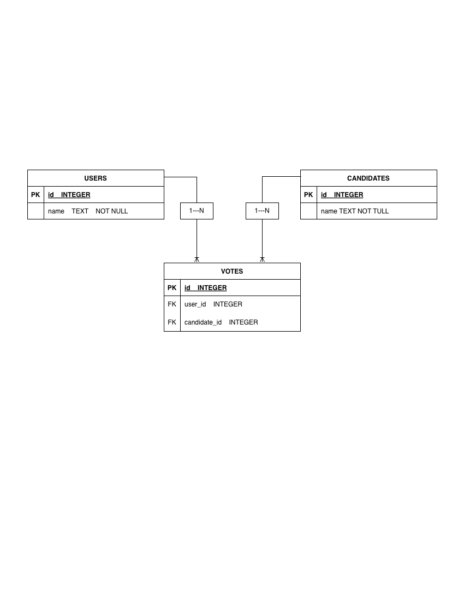

# SISTEM VOTING ONLINE (E-VOTING)


## Deskripsi Singkat
Proyek ini adalah aplikasi **Sistem Voting Online (Fullstack)** yang dikembangkan untuk memenuhi Tugas Proyek Akhir Mata Kuliah *Backend Web Development*. Aplikasi ini dirancang untuk memfasilitasi proses pemungutan suara digital yang aman, transparan, dan *real-time*.

Sistem ini memfasilitasi dua jenis pengguna (Admin dan User) untuk berpartisipasi dalam pemilihan umum atau survei. Fitur utamanya mencakup manajemen polling yang dinamis, validasi "One Man One Vote", batasan waktu (deadline) otomatis, dan transparansi hasil voting yang terjaga hingga pemilihan berakhir.

---

## Daftar Anggota
Berikut adalah tim pengembang **Kelompok 2** beserta peran dan tugas masing-masing:

| No | Nama Lengkap | NIM | Username GitHub | Peran / Tugas |
|:--:|:----------------------------------|:-----------:|:-----------------------------------|:-----------------------------------|
| 1 | **Anak Agung Made Agung Dananjaya** | 230030447 | [gungdanan2005-maker](https://github.com/gungdanan2005-maker) | **Project Manager & Setup:** Konfigurasi awal FastAPI dan struktur proyek. |
| 2 | **Ida Bagus Gde Yoga Pramana** | 240030457 | [Yoga240030457](https://github.com/Yoga240030457) | **Database Designer:** Perancangan skema database dan relasi antar tabel (ERD). |
| 3 | **Zacky Cahya Afrizai** | 240030268 | [ZCASTUDIO](https://github.com/ZCASTUDIO) | **Repository Engineer:** Implementasi logika CRUD database dan query. |
| 4 | **I Dewa Gede Punia Atmaja** | 220030750 | [dodepunia2002](https://github.com/dodepunia2002) | **Auth & Integration:** Layanan autentikasi (JWT) dan integrasi Backend ke Frontend. |
| 5 | **I Made Anom Wibawa** | 240030465 | [AnomWibawa](https://github.com/AnomWibawa) | **QA & Documentation:** Pengujian fitur dan penyusunan laporan/dokumentasi. |

---

## Lingkungan Pengembangan
Aplikasi ini dikembangkan menggunakan alat dan teknologi berikut:

* **Bahasa Pemrograman:** Python 3.11+
* **Framework Backend:** FastAPI (Kinerja tinggi, validasi data otomatis)
* **Database:** SQLite (Relasional, file-based)
* **ORM (Object Relational Mapping):** SQLAlchemy
* **Autentikasi & Keamanan:**
    * `Passlib[bcrypt]`: Hashing password satu arah.
    * `PyJWT`: Tokenisasi sesi login (JSON Web Token).
* **Server:** Uvicorn (ASGI Server)
* **Frontend:** HTML5, CSS3, JavaScript (Native/Vanilla)
* **Tools:** Visual Studio Code, Git, GitHub, Postman / Swagger UI.

---

## Proses Bisnis
Alur kerja utama aplikasi ini berjalan sebagai berikut:

1.  **Registrasi & Autentikasi:**
    Pengguna (Pemilih) harus mendaftar akun terlebih dahulu. Setelah terdaftar, pengguna melakukan login untuk mendapatkan Token Akses (JWT). Tanpa token ini, pengguna tidak dapat mengakses fitur voting.
2.  **Pembuatan Polling (Admin/User):**
    Pengguna dapat membuat topik polling baru. Saat membuat, pengguna wajib menyertakan Judul, Deskripsi, dan **Batas Waktu (Deadline)** kapan voting ditutup.
3.  **Manajemen Kandidat:**
    Setelah polling dibuat, pemilik polling menambahkan opsi kandidat yang akan dipilih.
4.  **Pelaksanaan Voting:**
    * Pengguna melihat daftar polling yang aktif.
    * Pengguna memilih salah satu kandidat.
    * **Validasi Sistem:** Sistem memeriksa apakah pengguna *sudah pernah memilih* di polling tersebut. Jika sudah, vote ditolak (Prinsip *One Man One Vote*). Sistem juga memeriksa apakah waktu saat ini belum melewati deadline.
5.  **Hasil & Rekapitulasi:**
    * Jika waktu voting masih berjalan: Hasil voting **disembunyikan** untuk menjaga kerahasiaan.
    * Jika waktu voting berakhir (Deadline lewat): Hasil perolehan suara ditampilkan secara terbuka dan *real-time*.

---

## ERD (Entity Relationship Diagram)
Model data aplikasi dirancang untuk menangani relasi antara Pengguna, Polling, Kandidat, dan Suara.



*Gambar: Diagram Relasi Entitas Sistem Voting Online*

---

## Struktur Database
Database SQLite terdiri dari 4 tabel utama dengan rincian sebagai berikut:

### 1. Tabel `users`
Menyimpan informasi akun pengguna.
* **id** (Primary Key, Int): ID unik pengguna.
* **email** (String, Unique): Alamat email untuk login.
* **username** (String): Nama tampilan pengguna.
* **password** (String): Password yang sudah di-hash (bukan plain text).
* **role** (String): Peran akun ('admin' atau 'user').
* **is_active** (Bool): Status aktif akun.

### 2. Tabel `polls`
Menyimpan topik atau sesi voting.
* **id** (Primary Key, Int): ID unik polling.
* **title** (String): Judul polling.
* **description** (String): Deskripsi singkat.
* **deadline** (DateTime): Waktu kapan voting ditutup.
* **creator_id** (Foreign Key -> users.id): ID pembuat polling.

### 3. Tabel `candidates`
Menyimpan opsi pilihan dalam sebuah polling.
* **id** (Primary Key, Int): ID unik kandidat.
* **name** (String): Nama kandidat.
* **description** (String): Visi misi atau keterangan kandidat.
* **poll_id** (Foreign Key -> polls.id): ID polling tempat kandidat berada.

### 4. Tabel `votes`
Tabel transaksi untuk merekam suara dan mencegah pemilihan ganda.
* **id** (Primary Key, Int): ID unik suara.
* **user_id** (Foreign Key -> users.id): Siapa yang memilih.
* **candidate_id** (Foreign Key -> candidates.id): Siapa yang dipilih.
* **poll_id** (Foreign Key -> polls.id): Di polling mana suara diberikan.

---

## Hasil Pengembangan
Fitur-fitur utama yang berhasil diimplementasikan dalam proyek ini:

1.  **Sistem Autentikasi JWT:**
    Implementasi login aman dengan token yang memiliki masa berlaku (expire time). Melindungi endpoint API dari akses tidak sah.
2.  **Manajemen Polling Lengkap (CRUD):**
    Kemampuan untuk Membuat (Create), Membaca (Read), Mengedit (Update), dan Menghapus (Delete) polling. Dilengkapi logika otorisasi dimana hanya pemilik polling atau Admin yang bisa mengedit/menghapus.
3.  **Kontrol Batas Waktu (Time-Limit):**
    Logika backend yang otomatis menolak suara baru jika waktu server sudah melewati `deadline` polling.
4.  **Validasi Suara Unik:**
    Penerapan constraint logika di database dan service layer untuk memastikan satu User ID hanya muncul satu kali per Poll ID di tabel Votes.
5.  **Dashboard Frontend Terintegrasi:**
    Antarmuka web responsif yang terhubung ke API, memungkinkan user melakukan semua aksi (Login, Buat, Vote, Edit) tanpa mengetik kode.

---

## Struktur Folder
Proyek disusun menggunakan arsitektur *Layered* (Router-Service-Repository) untuk memisahkan tanggung jawab kode.

```plaintext
Proyek-Akhir-backend-voting/
├── app/
│   ├── core/           # Konfigurasi inti (Security, Hashing, Config)
│   ├── database/       # Setup koneksi database SQLite
│   ├── models/         # Definisi Struktur Tabel (SQLAlchemy Models)
│   ├── routers/        # Endpoint API / Controller (Menangani Request HTTP)
│   ├── repository/     # Akses Data (Query langsung ke Database)
│   ├── schemas/        # Validasi Data Input/Output (Pydantic Models)
│   ├── services/       # Logika Bisnis Kompleks (Business Logic Layer)
│   └── main.py         # Entry Point Aplikasi (Inisialisasi FastAPI)
├── Frontend/           # File Antarmuka Pengguna (HTML, CSS, JS)
├── document/           # Dokumen pelengkap (Laporan, ERD, DFD)
├── requirements.txt    # Daftar pustaka/library Python yang digunakan
├── voting.db           # File Database (Dibuat otomatis saat dijalankan)
└── README.md           # Dokumentasi Proyek ini

```

---

## Cara Instalasi dan Menjalankan Aplikasi

Ikuti langkah-langkah berikut untuk menjalankan proyek di komputer lokal:

### 1. Persiapan Environment

Pastikan Python sudah terinstal. Buka terminal di dalam folder proyek, lalu jalankan:

**Untuk Windows:**

```bash
python -m venv venv
venv\Scripts\activate

```

**Untuk Mac/Linux:**

```bash
python3 -m venv venv
source venv/bin/activate

```

### 2. Instalasi Dependensi

Install semua library yang dibutuhkan sistem:

```bash
pip install -r requirements.txt

```

### 3. Menjalankan Server

Jalankan server backend menggunakan Uvicorn:

```bash
uvicorn app.main:app --reload

```

*Server akan berjalan di alamat: `http://127.0.0.1:8000*`

### 4. Mengakses Aplikasi

* **Web Dashboard:** Buka file `Frontend/index.html` di browser Anda (Chrome/Edge/Safari).
* **Dokumentasi API (Swagger UI):** Akses `http://127.0.0.1:8000/docs` untuk melihat dan menguji endpoint API secara interaktif.

---

*Dokumen ini disusun untuk memenuhi kelengkapan laporan Tugas Akhir Semester.*

```

```